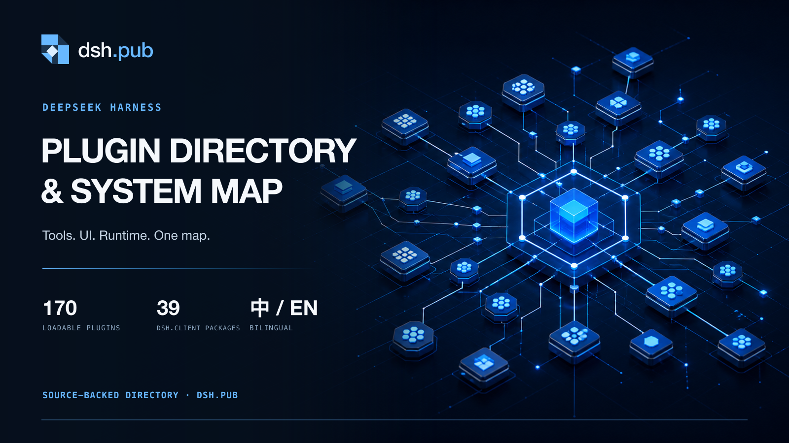
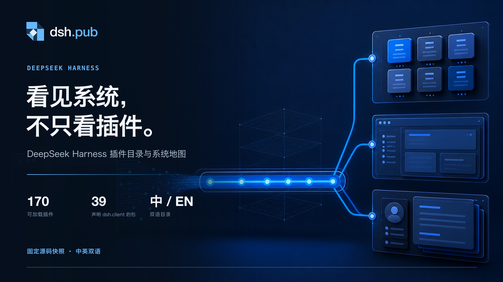
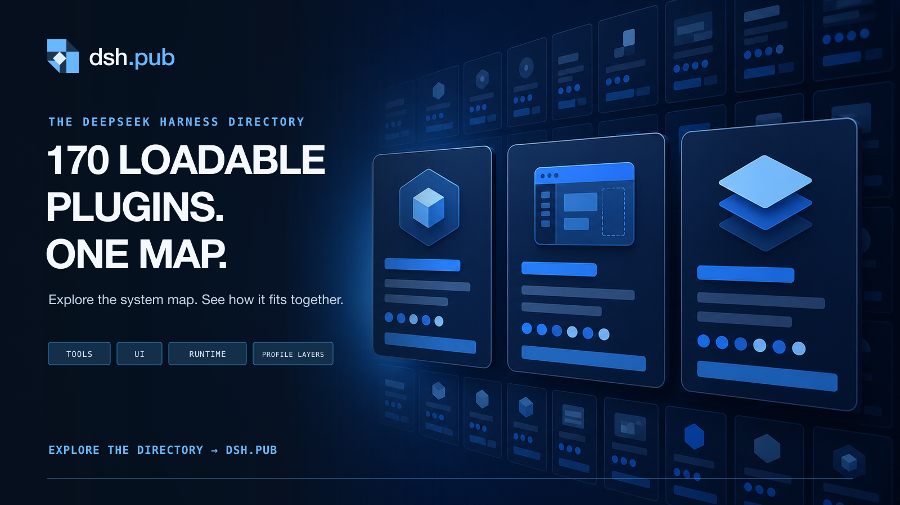

# dsh.pub X launch batch 01

Status: review only — not published.

Format: 1600 × 900 PNG (16:9). The three source backgrounds were generated with the built-in image generation mode, then exact copy, logo, and catalog numbers were rendered deterministically with `render-social-cards.mjs`.

## Recommendation

| Rank | Asset                      | One-glance clarity | Feed impact | Product fidelity | Best use                   |
| ---- | -------------------------- | -----------------: | ----------: | ---------------: | -------------------------- |
| 1    | `01-ecosystem-map-en.png`  |                5/5 |         5/5 |            4.5/5 | Launch / pinned post       |
| 2    | `02-capability-bus-zh.png` |              4.5/5 |       4.5/5 |            4.5/5 | Chinese developer audience |
| 3    | `03-catalog-cards-en.png`  |              4.5/5 |         4/5 |              5/5 | Product explanation        |

Primary recommendation: use **01 Ecosystem Map** for the first launch post. It names the product category directly and still has a visual hook at thumbnail size.

## 01 — Ecosystem map / primary



### Chinese post copy

```text
DeepSeek Harness 到底内置了什么？

我把它做成了 dsh.pub：一个基于固定源码快照生成的双语插件目录与系统地图。

170 个可加载插件、39 个声明 dsh.client 的包、3 个内置 profile bundles。先看清系统，再决定从哪里进入。

https://dsh.pub/zh/
```

### English post copy

```text
What’s actually inside DeepSeek Harness?

dsh.pub maps the system from a fixed source snapshot: 170 loadable plugins, 39 packages declaring dsh.client, and 3 built-in profile bundles.

Search the runtime. See how it fits together.

https://dsh.pub/en/
```

## 02 — Capability bus / Chinese



### Chinese post copy

```text
很多 AI 工具生态最难的，不是缺能力，而是你根本看不见能力藏在哪里。

dsh.pub 把 DeepSeek Harness 里的 plugins、dsh.client packages 和 profile layers 拆开呈现：170 个可加载插件，39 个声明 dsh.client 的包，中英双语。

看见系统，不只看插件。
https://dsh.pub/zh/
```

### English post copy

```text
The hard part of an AI-tool ecosystem is visibility, not capability.

dsh.pub maps DeepSeek Harness plugins, dsh.client packages, and built-in profiles as distinct layers—so developers can find the right entry point.

https://dsh.pub/en/
```

## 03 — Catalog cards / number hook



### Chinese post copy

```text
如果一个插件生态需要靠翻源码才能搞明白，它就还没有真正被地图化。

dsh.pub 把 DeepSeek Harness 做成了可检索的双语系统地图：170 个可加载插件，39 个声明 dsh.client 的包，以及明确区分的内置 profile bundles。

170 plugins. One map.
https://dsh.pub/zh/
```

### English post copy

```text
170 loadable plugins. One map.

If source code is the only map, an ecosystem hasn’t been mapped yet.

dsh.pub makes DeepSeek Harness searchable and bilingual—while keeping plugins, dsh.client packages, and built-in profiles distinct.

https://dsh.pub/en/
```

## Prompt set

- Ecosystem map: a DeepSeek-blue constellation of modular nodes connected through an inspectable capability bus.
- Capability bus: a blank terminal surface flowing into plugin, client/UI, and profile layers.
- Catalog cards: a disciplined depth field of plugin, UI, and profile cards with no generated microcopy.

All generated backgrounds intentionally contained no text. This keeps the domain, claims, and source-backed counts exact in the final assets.
