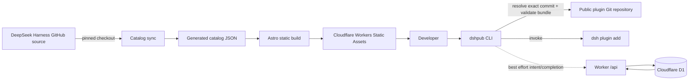

# Architecture

## Runtime and persistence boundaries



- GitHub owns plugin source, README content, and catalog provenance.
- The generated JSON is a build artifact checked into this repository for deterministic static
  builds.
- Astro owns SEO-friendly English and Chinese pages; catalog filtering uses small client scripts.
- The Worker runs before static assets only for `/`, `/api/*`, and explicitly configured routes.
- D1 stores only install event state and aggregate counters. It does not store plugin code or user
  identities.

## Repository layout

```text
apps/
├── web/       Astro static site and browser interactions
├── server/    Cloudflare Worker API and static-asset routing
└── cli/       Git bundle installer and best-effort telemetry
packages/
└── catalog/   generated catalog, schema, and sync tests
migrations/    D1 schema
```

## Install protocol

```mermaid
sequenceDiagram
    participant CLI as dshpub CLI
    participant API as dsh.pub Worker
    participant Git as GitHub
    participant DSH as Native dsh CLI
    participant D1

    CLI->>Git: fetch requested ref at depth 1
    CLI->>CLI: validate package.json dsh.bundle.patch and resolve exact commit
    CLI->>CLI: remove temporary validation checkout
    CLI->>API: POST install-intent(eventId, slug, exact commit)
    Note over CLI,API: Failure is non-blocking
    CLI->>DSH: dsh plugin --profile P add commit-pinned Git spec
    alt native install succeeds
        CLI->>API: POST install-completion(eventId)
        API->>D1: pending -> completed + idempotent counter
    else validation/install fails
        CLI-->>CLI: exit non-zero; never send completion
    end
```

The current built-in Harness bundle layers have no install events: they require the Harness
monorepo's `workspace:` dependency graph and are not independently installable Git packages. For a
future external bundle, the public number means exactly “completed installs reported by this CLI.”
Direct clones, native `dsh plugin add`, offline use, and telemetry opt-out are intentionally
invisible.

## Web stack decision

Astro static generation is selected over a client-only React/Vite app because the dominant objects
are public catalog and detail pages that benefit from complete HTML, stable URLs, low JavaScript,
and build-time localization. A server-rendered Next.js application would add runtime and deployment
surface without an MVP need for authenticated or per-user rendering.

## API surface

| Method | Route                      | Purpose                                           |
| ------ | -------------------------- | ------------------------------------------------- |
| `POST` | `/api/install-intents`     | Idempotently record a pending CLI event           |
| `POST` | `/api/install-completions` | Complete a known pending event and increment once |
| `GET`  | `/api/plugins/:slug/stats` | Read a plugin's completed CLI install total       |

Install intents and statistics also require a slug from the checked-in installable registry; this
keeps arbitrary keys out of D1 but does not prove that a caller used the CLI. CORS is limited to the
production site and localhost development origins. Rate limiting and stronger abuse controls remain
an operational layer; event IDs provide idempotency, not identity or proof of use.
