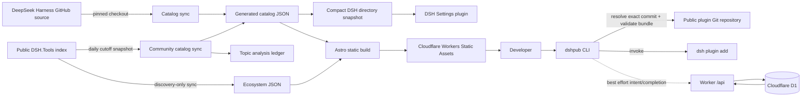
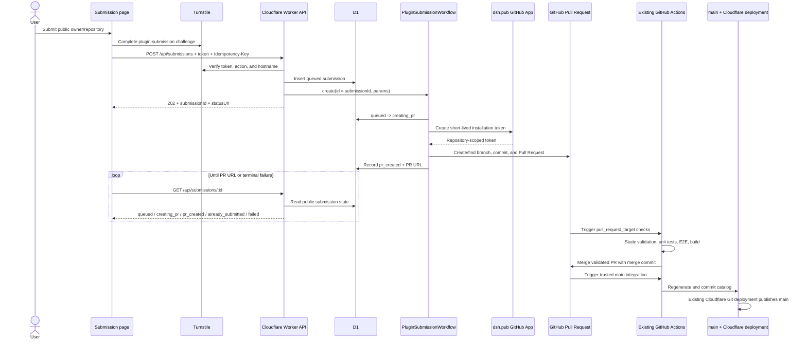

# Architecture

## Runtime and persistence boundaries



- GitHub owns plugin source, README content, and catalog provenance.
- DSH.Tools supplies a checked-in discovery snapshot; every ecosystem record points back to its
  canonical GitHub repository and carries no compatibility, installability, review, or safety claim.
- The generated JSON is a build artifact checked into this repository for deterministic static
  builds. Catalog entries store pinned `raw.githubusercontent.com` README URLs rather than README
  bodies; the Astro build fetches those URLs and embeds sanitized HTML into detail pages
  (`DSH_SKIP_README_FETCH=1` skips the network for offline checks).
- The DSH plugin generator projects the same public `plugin` and `bundle` records into a smaller
  checked-in snapshot. Its browser bundle reads only that local data, contributes one
  `settings.section`, and has an empty Host `apply`; browsing performs no network fetch and loads no
  third-party package.
- Astro owns SEO-friendly English and Chinese pages; catalog filtering uses small client scripts.
- The Worker runs before static assets only for `/`, `/api/*`, and explicitly configured routes.
- D1 stores install event state, aggregate counters, and the public operational state of plugin
  submissions. It does not store plugin code, submitter identities, GitHub App private keys, or
  installation tokens.

## Asynchronous plugin submission



The synchronous browser request ends after the durable job is accepted; GitHub latency and retries
remain inside the Workflow. The browser polls D1-backed status and receives the Pull Request URL as
soon as it exists. D1 is the product-facing job ledger, while GitHub remains the source of truth for
the Pull Request, checks, merge commit, catalog commit, and deployment history.

Turnstile rejects automated submissions before a Workflow is created. The API also requires an
`Idempotency-Key`; the same UUID is used as both the D1 primary key and Workflow instance ID, so a
browser retry cannot intentionally create a second job for the same request. A key reused with a
different repository is rejected.

The Workflow's GitHub step is retry-safe: it creates or finds the deterministic submission branch
and Pull Request. It requests a short-lived installation token only inside that step and returns
only non-secret identifiers such as commit SHA, Pull Request number, and URL. The App private key
and installation token must never enter D1, the immutable Workflow event payload, persisted step
outputs, logs, or frontend responses. The repository ID is passed when requesting an installation
token so the token remains limited to the dsh.pub repository.

The existing `pull_request_target` workflow keeps its trust boundary: it checks out trusted registry
code from the base commit, reads the submission from the exact Pull Request head commit, never
executes code from the nominated plugin repository, and merges only when the pinned head and base
still match the validated revisions.

## Repository layout

```text
apps/
├── web/        Astro static site and browser interactions
├── server/     Cloudflare Worker API and static-asset routing
├── cli/        Git bundle installer and best-effort telemetry
└── dsh-plugin/ Read-only DSH Settings directory and committed client bundle
packages/
└── catalog/    generated Registry and ecosystem snapshots, shared topics, schema, and sync tests
migrations/    D1 schema
```

## Install protocol

```mermaid
sequenceDiagram
    participant CLI as dshpub CLI
    participant API as dsh.pub Worker
    participant Git as GitHub
    participant DSH as Native dsh CLI
    participant D1

    CLI->>Git: fetch requested ref at depth 1
    CLI->>CLI: validate package.json dsh.bundle.patch and resolve exact commit
    CLI->>CLI: remove temporary validation checkout
    CLI->>API: POST install-intent(eventId, slug, exact commit)
    Note over CLI,API: Failure is non-blocking
    CLI->>DSH: dsh plugin --profile P add commit-pinned Git spec
    alt native install succeeds
        CLI->>API: POST install-completion(eventId)
        API->>D1: pending -> completed + idempotent counter
    else validation/install fails
        CLI-->>CLI: exit non-zero; never send completion
    end
```

The current built-in Harness bundle layers have no install events: they require the Harness
monorepo's `workspace:` dependency graph and are not independently installable Git packages. For a
future external bundle, the public number means exactly “completed installs reported by this CLI.”
Direct clones, native `dsh plugin add`, offline use, and telemetry opt-out are intentionally
invisible.

## Web stack decision

Astro static generation is selected over a client-only React/Vite app because the dominant objects
are public catalog and detail pages that benefit from complete HTML, stable URLs, low JavaScript,
and build-time localization. A server-rendered Next.js application would add runtime and deployment
surface without an MVP need for authenticated or per-user rendering.

## API surface

| Method | Route                      | Purpose                                                 |
| ------ | -------------------------- | ------------------------------------------------------- |
| `GET`  | `/api/submission-config`   | Return the public Turnstile site key                    |
| `POST` | `/api/submissions`         | Verify Turnstile, persist a job, and start the Workflow |
| `GET`  | `/api/submissions/:id`     | Read submission status and the Pull Request URL         |
| `POST` | `/api/install-intents`     | Idempotently record a pending CLI event                 |
| `POST` | `/api/install-completions` | Complete a known pending event and increment once       |
| `GET`  | `/api/plugins/:slug/stats` | Read a plugin's completed CLI install total             |

Install intents and statistics also require a slug from the checked-in installable registry; this
keeps arbitrary keys out of D1 but does not prove that a caller used the CLI. CORS is limited to the
production site and localhost development origins. Rate limiting and stronger abuse controls remain
an operational layer; event IDs provide idempotency, not identity or proof of use.

## GitHub repository protection boundary

The GitHub App is installed only on `dsh-pub/dsh-pub`. Worker installation tokens are restricted to
that repository ID and to Contents and Pull requests write access. GitHub Actions also needs the
repository variable `DSH_PUB_APP_CLIENT_ID` and repository secret
`DSH_PUB_APP_PRIVATE_KEY_PKCS8`. These Actions names avoid GitHub's reserved `GITHUB_` prefix; the
Worker keeps its existing `GITHUB_APP_*` bindings. The App mints separate short-lived tokens at the
point of use:

| Workflow operation                   | App token permission   | Timing                                  |
| ------------------------------------ | ---------------------- | --------------------------------------- |
| Refresh a submission branch          | `pull_requests: write` | Only after exact PR/base/head checks    |
| Commit a validated generated catalog | `contents: write`      | Only after every quality gate and build |

The untrusted Pull Request validation job cannot access the App action, private key, or token. PR
queries and the final merge API call continue to use the job-scoped `GITHUB_TOKEN`; only the
`update-branch` request and trusted catalog fast-forward push use the App identity.

Two active repository rulesets protect `refs/heads/main`:

| Ruleset              | Rules                               | Bypass actors                          |
| -------------------- | ----------------------------------- | -------------------------------------- |
| `main-pr-gate`       | Pull Request; merge commits allowed | dsh.pub GitHub App Integration, always |
| `main-ref-integrity` | deletion; non-fast-forward          | none                                   |

The split is a security boundary: bypass applies to an entire ruleset. Combining these rules would
let the App bypass deletion and non-fast-forward protection while committing the catalog. Do not
add repository administrators, organization administrators, repository roles, or the GitHub Actions
Integration as bypass actors. The PR gate intentionally has zero required approvals and no required
status-check rule because the trusted submission workflow already performs and pins the complete
validation before calling the merge endpoint.

## Submission runtime configuration and deployment

`wrangler.jsonc` binds `DB`, static `ASSETS`, and `PLUGIN_SUBMISSION_WORKFLOW` to one Worker whose
main module exports both the default fetch handler and the named `PluginSubmissionWorkflow` class.
No cross-script `script_name` or service binding is required.

| Name                           | Classification   | Runtime use                                           |
| ------------------------------ | ---------------- | ----------------------------------------------------- |
| `TURNSTILE_SITE_KEY`           | Public config    | Render the browser challenge                          |
| `TURNSTILE_SECRET_KEY`         | Secret           | Verify Turnstile server-side                          |
| `GITHUB_APP_CLIENT_ID`         | Config           | Identify the GitHub App when signing its JWT          |
| `GITHUB_APP_INSTALLATION_ID`   | Config           | Select the repository-scoped App installation         |
| `GITHUB_APP_PRIVATE_KEY_PKCS8` | Secret           | Sign the GitHub App JWT; PKCS#8 PEM only              |
| `GITHUB_TARGET_REPOSITORY_ID`  | Config           | Restrict the installation token to the target repo ID |
| `PLUGIN_SUBMISSION_WORKFLOW`   | Wrangler binding | Start and inspect durable submission instances        |
| `DB`                           | Wrangler binding | Persist install metrics and public submission states  |

Production deploys must preserve this ordering:

```bash
npm run build
npx wrangler d1 migrations apply DB --remote
npx wrangler secret put TURNSTILE_SITE_KEY
npx wrangler secret put TURNSTILE_SECRET_KEY
npx wrangler secret put GITHUB_APP_CLIENT_ID
npx wrangler secret put GITHUB_APP_INSTALLATION_ID
npx wrangler secret put GITHUB_APP_PRIVATE_KEY_PKCS8
npx wrangler secret put GITHUB_TARGET_REPOSITORY_ID
npx wrangler deploy
```

The build proves the static and Worker bundle is packageable; the remote migration creates the D1
submission ledger before new code can address it; secrets/config are then bound to the Worker; and
the final deploy publishes the assets, API, Workflow class, and bindings together. Local development
uses ignored `.dev.vars` values and `npx wrangler d1 migrations apply DB --local`. Workflows run in
local Wrangler mode; `wrangler dev --remote` and remote Workflow bindings are not supported.
