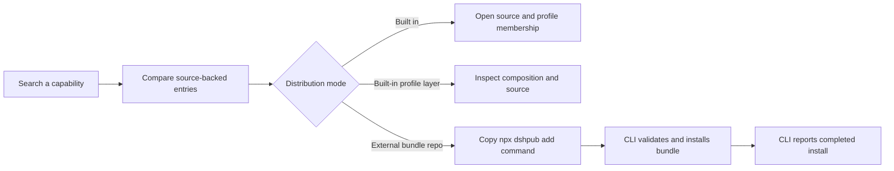

# Product Definition

> Status: MVP decision record. Supporting evidence belongs in [`research.md`](research.md).

## Product thesis

DeepSeek Harness is deliberately built from plugins, but source packages, runtime-loadable modules,
UI contributions, model tools, and installable bundles are different things. A useful marketplace
must make those boundaries legible instead of presenting every package as if it were independently
installable.

## First user and job

- **First user:** A developer extending or adopting DeepSeek Harness.
- **Job to be done:** Find a capability, understand where and how it runs, inspect its source, and
  use the correct installation or inclusion path with confidence.
- **Current alternative:** Search the Harness monorepo, package manifests, patch files, and docs by
  hand.

## Positioning

For developers who need to discover and compose DeepSeek Harness capabilities, **dsh.pub** is a
bilingual registry that turns source-backed runtime metadata into searchable, comparable plugin
pages. Unlike a generic GitHub list, it distinguishes atomic modules, built-in profile layers, and
independently distributed bundles while showing UI slots, tools, configuration, profiles, and
install semantics in one place.

## Core workflow



## Product objects

| Object          | User-facing meaning                            | Owned data or behavior                         |
| --------------- | ---------------------------------------------- | ---------------------------------------------- |
| Catalog entry   | A searchable Harness capability                | Generated metadata plus GitHub source revision |
| Built-in plugin | A Cordis-loadable module shipped in Harness    | Profile membership, config, tools, UI slots    |
| Profile bundle  | A patch layer that activates a profile         | Bundle patch and built-in profile membership   |
| External bundle | An independently installable profile layer     | Git repository and CLI install command         |
| Install event   | One CLI-reported completed bundle installation | D1 event id, slug, version/ref, status         |
| Locale page     | English or Chinese view of the same entry      | URL locale and localized source docs           |

## Catalog layers

```text
Marketplace
├── Built-in profile bundles            activation role, no install claim
├── External bundle repositories        command + CLI install count (future)
├── Built-in plugins                    included/profile status + capabilities
└── SDK & internals                     seams/libraries, hidden by default
```

The initial Harness source snapshot contains 219 `@deepseek-ai/dsh-*` packages: 170 are loadable
plugins, 15 seams, 34 libraries, and 3 manifests declare a bundle. These counts are generated and
tested; they are not hand-authored marketing claims.

## MVP scope

- Static English and Chinese landing, catalog, and detail pages.
- Search, category/type filters, and source links for the Harness snapshot.
- Clear badges for Web UI, configurable, built-in, default profile, and profile-layer status.
- A copyable CLI command only when a bundle is independently installable; the current Harness
  monorepo bundles intentionally show none.
- D1-backed totals labeled **CLI-reported completed installs**.
- A zero-account CLI that accepts a public GitHub repository, validates `dsh.bundle.patch`, invokes
  the native DSH installer, and reports completion without blocking success when telemetry fails.
- A zero-account community submission flow: a bilingual page opens a structured GitHub Issue, machine-valid
  public bundles are integrated into `main`, and Cloudflare deploys them through the existing Git
  integration.
- A daily `dsh-plugin` Topic intake: a cutoff snapshot statically validates root bundle contracts,
  lists passing repositories, and keeps machine-readable rejection reasons without executing
  third-party code.
- Markdown and HTML registry badges whose live state is either `not listed` or `listed`.

## Non-goals

- User accounts, publisher dashboards, reviews, likes, payments, or hosted plugin artifacts.
- Claiming unique users, repository downloads, active use, or installs made outside the CLI.
- Treating every source package as independently installable.
- Human review, security certification, or editorial ranking of every third-party submission.

## Success signals

- A developer can reach a representative plugin detail page from search in under three actions.
- The initial three bundles are visibly marked as built-in profile layers, with no false install
  command or download count.
- Every future visible install command maps to an independently distributed, manifest-declared
  bundle and passes CLI validation.
- English and Chinese routes contain the same source revision and capability facts.
- Direct Git installs and disabled telemetry are described as unobserved rather than counted.

## Open decisions

- Whether a later score combines docs quality, validation, maintenance, and compatibility.
