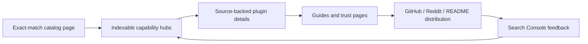

# dsh.pub SEO / SERP competitor audit

> Observed 2026-08-14. Google results, repository counts, catalog sizes, and page content are time-sensitive snapshots. This report separates observed facts from recommendations and does not treat a ranking snapshot as a causal explanation.

## Executive conclusion

dsh.pub is not losing because it lacks a sitemap or basic metadata. Its production site already has canonical URLs, `hreflang`, a sitemap, bilingual static plugin pages, and more truthful structured data than several competitors. The immediate gap is **search-intent coverage and distribution**:

1. The production catalog page is titled `Plugins · dsh.pub`, while current winners put `DSH Plugin Registry`, `DeepSeek Harness Plugins`, or both in the title and visible heading.
2. dsh.pub exposes filters as query parameters, but competitors publish crawlable category, compatibility, guide, methodology, trending, FAQ, and security landing pages.
3. dsh.pub detail pages are richly source-backed, but they do not form a strong internal-link graph through indexable categories, related plugins, authors, use cases, or guides.
4. Competitors launched distribution at the same time as the site: GitHub Discussions, Reddit, GitHub topics, an awesome list, repository PRs, feeds, badges, and in-agent search. Google is already surfacing those ecosystem mentions.

The right strategy is therefore:



Do not answer this with hundreds of automatically copied GitHub pages. Google explicitly treats scaled pages created mainly to manipulate rankings, including low-value scraping, as spam. The defensible advantage is the information dsh.pub can uniquely verify: distribution semantics, pinned source, manifest facts, runtime contributions, compatibility evidence, and honest review status. See [Google spam policies](https://developers.google.com/search/docs/essentials/spam-policies).

## Evidence boundary

- Google SERPs were inspected through the live Google UI with `hl=en`, `gl=us`, and `pws=0`; Google redirected to `google.com.hk` and displayed “Results are not personalized.” Location was unavailable. Rankings can differ by locale, device, time, and account context.
- The four required queries were checked on 2026-08-14. The exact phrase query used quotation marks; the other three were unquoted.
- Production dsh.pub was fetched separately from the local checkout. At observation time, the local worktree also contained concurrent, uncommitted SEO changes. Production facts below refer to the fetched public site, not those local changes.
- No Google Search Console query, index-coverage, or URL Inspection data was available in this audit. Consequently, this report can show that dsh.pub was absent from the observed first page, but cannot prove whether the cause is discovery delay, indexing, canonical selection, relevance, or authority.
- Structured data observations describe markup found in page HTML. Eligibility for a Google rich result is governed by Google's supported features and policies; schema markup alone is not a ranking factor or display guarantee. See [Google structured data guidelines](https://developers.google.com/search/docs/appearance/structured-data/sd-policies).

## 1. Live Google SERP snapshot

| Query                              | Strong visible results                                                                                                                                                                                                                          | Observed intent                                                                                                                                                           | dsh.pub status |
| ---------------------------------- | ----------------------------------------------------------------------------------------------------------------------------------------------------------------------------------------------------------------------------------------------- | ------------------------------------------------------------------------------------------------------------------------------------------------------------------------- | -------------- |
| `"dsh plugin registry"`            | 1. [dsh-plugin.net](https://dsh-plugin.net/) — “DSH Plugin Registry — DeepSeek Harness Plugins”; 2. [dshplugin.app](https://dshplugin.app/) — “DeepSeek Harness Plugins – DSH Plugin Registry”                                                  | Exact directory / evaluation / install intent. Only two results were visible, so this is still an open keyword rather than a mature, authority-locked SERP.               | Not visible.   |
| `dsh plugins`                      | [awesome-dsh-plugin.com](https://awesome-dsh-plugin.com/), [dshplugins.com](https://dshplugins.com/), official DeepSeek, an official GitHub Discussion module, an ecosystem Reddit post, Yooiu, a GitHub topic search, and explanatory articles | Mixed directory discovery, community proof, current discussion, and explanation. Fresh GitHub/Reddit/X surfaces are part of the result set, not just standalone websites. | Not visible.   |
| `deepseek harness plugins`         | [DeepSeek's official Harness page](https://deepseek.com/harness), news/video/discussion modules, then [DeepSeek Harness Plugins by Category](https://deepseek-code.com/plugins) and setup content                                               | Broad informational/news intent first; category browsing and installation are secondary. A pure registry homepage cannot own the entire SERP.                             | Not visible.   |
| `deepseek harness plugin registry` | Official DeepSeek, [official GitHub repository](https://github.com/deepseek-ai/deepseek-harness), news/X, architecture docs, and awesome-list pages                                                                                             | Google currently interprets “plugin registry” partly as the Harness architecture's tool/plugin registry, because dedicated registry content is still sparse.              | Not visible.   |

### What this means

- The exact `dsh plugin registry` target is winnable now: there were only two exact directory results in the observed page.
- `dsh plugins` is the best commercial/discovery cluster, but ranking requires both a purpose-built directory page and ecosystem distribution.
- `deepseek harness plugins` needs an informational content cluster around the directory: what plugins are, how they install, how to build one, and how to judge compatibility.
- Search-result recency is unusually high because the ecosystem launched very recently. Fast, useful distribution now matters more than waiting for “domain age.” That is an inference from the result composition, not a Google ranking rule.

## 2. Current production baseline: what dsh.pub already has

Live evidence: [English home](https://dsh.pub/en/), [English plugin directory](https://dsh.pub/en/plugins/), [submission page](https://dsh.pub/en/submit/), [sitemap index](https://dsh.pub/sitemap-index.xml), and [robots.txt](https://dsh.pub/robots.txt).

| Surface              | Observed production state                                                                                                       | Assessment                                                                                                                                    |
| -------------------- | ------------------------------------------------------------------------------------------------------------------------------- | --------------------------------------------------------------------------------------------------------------------------------------------- |
| Homepage             | Title `dsh.pub — DeepSeek Harness plugin registry`; source-backed value proposition; `WebSite` JSON-LD                          | Good exact-topic anchor. The homepage is not the main browse URL, however, so it cannot replace an optimized catalog landing page.            |
| Plugin directory     | Title `Plugins · dsh.pub`; generic site description; `CollectionPage` JSON-LD                                                   | The weakest high-priority surface. The title does not state `DSH`, `DeepSeek Harness`, or `registry`, while every current direct winner does. |
| Plugin detail        | Unique slug, visible source/version/runtime/capability facts, README content, `SoftwareSourceCode` and `BreadcrumbList` JSON-LD | Stronger evidence than most competitors. This is dsh.pub's durable differentiator.                                                            |
| Internationalization | English and Chinese static URLs with canonical and reciprocal `hreflang`                                                        | Already stronger than English-only rivals; do not rebuild this.                                                                               |
| Sitemap              | 360 canonical URLs: 2 locale homepages, 2 catalog pages, 356 plugin details (178 entries × 2 locales), and 2 submission pages   | Coverage exists, but the sitemap has no category, guide, methodology, security, stats, author, or compatibility hubs.                         |
| Discovery UI         | Capability links and filters resolve to query parameters on the catalog                                                         | Useful UX, but not distinct, indexable category landing pages. The canonical remains the base catalog path.                                   |
| Submission           | Public GitHub Issue flow, pinned source, automated bundle-contract checks, and README badge                                     | More transparent than a generic form. Keep it; improve distribution around it.                                                                |
| Developer docs       | Navigation links to raw `/develop-plugin.md`                                                                                    | Helpful to humans, but it is not represented as a normal bilingual guide page in the observed sitemap/content cluster.                        |
| Internal links       | Homepage → selected plugins/catalog; catalog → every detail; detail → catalog/source                                            | Crawlable foundation exists, but detail pages lack related plugins, same-category pages, author pages, and guide links.                       |

Google says every important page should be linked from at least one other page with crawlable, descriptive `<a href>` links; a sitemap does not substitute for a coherent internal-link graph. See [Google link best practices](https://developers.google.com/search/docs/crawling-indexing/links-crawlable) and [sitemap overview](https://developers.google.com/search/docs/crawling-indexing/sitemaps/overview).

## 3. Direct competitor teardown

### 3.1 dsh-plugin.net — exact keyword architecture

- Homepage title: `DSH Plugin Registry — DeepSeek Harness Plugins`; H1: `Discover DSH plugins`.
- Sitemap snapshot: 40 URLs, including `/plugins`, `/categories`, eight `/category/*` pages, `/trending`, `/stats`, `/methodology`, `/security`, six `/compatible/*` pages, eight guides, submission, and 11 plugin details.
- Homepage content includes “Trending this week,” “Browse by capability,” “More than a list of links,” “Recently added,” and an ecosystem learning section.
- Its submission page accepts a GitHub repository, analyzes public metadata/root files, and then directs authors to add the official `dsh-plugin` topic. It states that it does not modify or publish the repository.
- Homepage markup includes `WebSite` + `SearchAction` JSON-LD.

What it has that production dsh.pub lacks: exact-match catalog title/H1, category URLs, compatibility hubs, trending/stats, methodology/security pages, and a guide cluster. Its weakness is depth: its sitemap contained only 11 plugin details, far below dsh.pub's 178 per language.

Sources: [homepage](https://dsh-plugin.net/), [submit](https://dsh-plugin.net/submit), [sitemap](https://dsh-plugin.net/sitemap.xml).

### 3.2 dshplugin.app — bilingual category landing pages

- Homepage title: `DeepSeek Harness Plugins – DSH Plugin Registry`; H1: `DeepSeek Harness Plugins`.
- Sitemap snapshot: 140 URLs: English/Chinese homepages, eight categories in each language, and 59 plugin details in each language, plus policy pages.
- Category routes use descriptive slugs such as `/categories/browser-web`, `/developer-tools`, `/security-policy`, and `/skills-workflows`.
- Homepage markup exposes `WebSite` JSON-LD; no stronger Google-supported rich-result strategy was evident from the homepage markup.

What it has that production dsh.pub lacks: bilingual, indexable category pages. What dsh.pub already does better: source-pin detail, runtime facts, breadcrumbs, and truthful install semantics.

Sources: [homepage](https://dshplugin.app/), [sitemap](https://dshplugin.app/sitemap.xml).

### 3.3 awesome-dsh-plugin.com + GitHub awesome list — category ownership and contribution loop

- Website title: `Awesome DSH Plugin — Curated DeepSeek Harness (dsh) Plugin List`.
- Sitemap snapshot: 24 URLs: homepage plus 11 category pages in English and Chinese (`/ui/`, `/theme/`, `/session/`, `/memory/`, `/tools/`, `/skill/`, `/workflow/`, `/notify/`, `/model/`, `/dev/`, `/fun/`).
- Homepage includes install instructions and “Get your plugin listed,” plus `ItemList` JSON-LD and an RSS/Atom-style `/feed.xml` link.
- The [GitHub repository](https://github.com/awesome-dsh-plugin/awesome-dsh-plugin) uses a long-tail title and H1 `Awesome DeepSeek Harness (DSH) Plugin`, bilingual READMEs, category anchors, PR contribution, and a visible “PRs welcome” loop.
- The companion [dsh-find-plugin](https://github.com/awesome-dsh-plugin/dsh-find-plugin) searches the official `dsh-plugin` GitHub topic inside an agent, ranks by stars, enriches matches with the awesome list's bilingual descriptions, and returns install commands.
- A launch post appeared on [Reddit](https://www.reddit.com/r/DeepSeek/comments/1vnc00p/awesome_dsh_plugin_a_curated_list_of_deepseek/), creating an external discovery surface immediately.

What it has that production dsh.pub lacks: category ownership, feed, GitHub PR network effects, and an in-agent discovery product. dsh.pub's submission checks and data truthfulness are stronger; the opportunity is to combine that rigor with the same distribution loop.

### 3.4 dshplugins.com — long-form landing page and review narrative

- Homepage title: `DSH Plugins — Discover DeepSeek Harness Plugins`; visible H1 begins `Find the right …`.
- The homepage is not only a grid. It contains sections for why builders use it, how discovery/inspection/install/verification work, a practical choosing guide, developer submission criteria, review quality, ecosystem explanation, and FAQ.
- Homepage markup includes `WebSite`, `CollectionPage`, and `ItemList` JSON-LD.
- Sitemap snapshot: 58 URLs, with 25 plugin details in English and Chinese plus submission and policy pages.
- Submission accepts a public GitHub repository and says an administrator reviews the record before publication.
- A [DeepSeek Harness GitHub Discussion](https://github.com/deepseek-ai/deepseek-harness/discussions/1045) was visible in Google for `dsh plugins`, demonstrating a distribution path into the official community surface.

What it has that production dsh.pub lacks: intent-complete homepage copy, FAQ/review narrative, and visible official-community distribution. Its catalog is much smaller and its verification depth is not obviously better than dsh.pub.

Sources: [homepage](https://dshplugins.com/), [submit](https://dshplugins.com/submit), [sitemap](https://dshplugins.com/sitemap.xml).

### 3.5 dsh.tools — automated breadth plus guides and trust signals

- Homepage title: `DSH.Tools : DeepSeek Harness Plugins & Tools`; H1: `DeepSeek Harness Plugins & Tools`.
- Homepage exposes use-case categories, trending, recently added, repository health, README inspection, compatibility evidence, FAQ, tools, and guide links.
- Sitemap snapshot: 505 plugin URLs plus four blog articles and about/FAQ/submit/policy pages.
- Detail pages include `What it does`, `Installation`, `Compatibility evidence`, `Plugin health`, and `Index provenance`.
- Guide cluster includes `What is DeepSeek Harness?`, `How to Install DeepSeek Harness Plugins`, `Best DeepSeek Harness Plugins: How to Choose`, and `How to Create a DeepSeek Harness Plugin`.
- Submission instructs authors to publish a public repository, add the `dsh-plugin` topic, write a useful README, and wait for catalog sync. The catalog is automatically discovered from public GitHub signals.
- No JSON-LD was observed on the fetched homepage/detail/guide templates; its advantage is content architecture, not schema.
- Its [Reddit launch/resource post](https://www.reddit.com/r/DeepSeek/comments/1vnzrsa/a_resource_for_exploring_the_growing_dsh_plugin/) directly names the user questions it targets: purpose, use case, maintenance, dependencies, permissions, supported versions, screenshots, and demos.

What it has that production dsh.pub lacks: breadth of community discovery, trust/health fields, guide cluster, FAQ, and fresh-content sections. Important caution: its broad automatic index includes items beyond strict installable DSH plugins, so copying its count would weaken dsh.pub's truthfulness.

Sources: [homepage](https://dsh.tools/), [plugins](https://dsh.tools/plugins), [example detail](https://dsh.tools/plugins/omdsh-dev-dsh-open-in-vscode), [blog](https://dsh.tools/blog), [submit](https://dsh.tools/submit), [sitemap](https://dsh.tools/sitemap.xml).

### 3.6 deepseek-code.com/plugins — long-tail programmatic cluster

- Plugins page title: `DeepSeek Harness Plugins by Category`; H1: `Explore plugins by category`.
- It renders eight large category sections with up to ten selected projects in each.
- Sitemap snapshot: 361 URLs, including 317 plugin pages and a `/hub` cluster with seven articles such as coding harness, Harness guide/status, comparison, and Reasonix review pages. Some hub pages are translated into Chinese, Traditional Chinese, and Korean.
- No JSON-LD was observed on the fetched plugins page.

What it has that production dsh.pub lacks: a broad informational hub and many long-tail plugin URLs. What dsh.pub must not copy: thin or weakly distinguished pages. The safer lesson is the hub/category architecture, not raw page volume.

Sources: [plugins by category](https://deepseek-code.com/plugins), [sitemap](https://deepseek-code.com/sitemap.xml).

## 4. Adjacent registry pattern worth borrowing

[skills.sh](https://www.skills.sh/) shows a more mature directory graph:

- `The Agent Skills Directory` homepage with `WebSite` + `SearchAction` JSON-LD.
- Distinct `/trending`, `/hot`, `/official`, `/audits`, `/packs`, `/topic/*`, `/agent/*`, owner, and skill detail pages.
- Its sitemap is split into miscellaneous, owner, and multiple skill sitemaps.
- Documentation explains ranking, badges, packs, and security.
- According to its [FAQ](https://www.skills.sh/docs/faq), actual CLI install telemetry brings skills into the leaderboard; [repository customization](https://www.skills.sh/docs/customize) lets owners control groupings.

The useful lesson is a many-to-many discovery graph—plugin ↔ category ↔ use case ↔ author ↔ compatibility—not the visual design. For dsh.pub, any ranking must clearly disclose what is measured and preserve the current telemetry privacy contract.

## 5. Gap matrix

| Capability               | dsh.pub production                                                     | Current winners                                                                                            | Gap                                                    |
| ------------------------ | ---------------------------------------------------------------------- | ---------------------------------------------------------------------------------------------------------- | ------------------------------------------------------ |
| Exact catalog title/H1   | Catalog title `Plugins · dsh.pub`; H1 emphasizes result count          | Every direct winner names `DSH` or `DeepSeek Harness Plugins`; exact registry winners also name `Registry` | P0                                                     |
| Indexable category pages | Query-string filters canonicalized to catalog                          | All major direct winners expose category URLs                                                              | P0                                                     |
| Detail-page evidence     | Source, version, license, runtime, tools/UI, README, install semantics | Often only GitHub metadata/README/health                                                                   | dsh.pub advantage                                      |
| Related/internal links   | Mostly catalog/source/navigation                                       | Category, trending, related content, guide links, owners                                                   | P0                                                     |
| Guides                   | Raw developer Markdown only                                            | What/install/create/choose/best/compatibility guides                                                       | P1                                                     |
| Trust pages              | Review notices embedded in UI                                          | Methodology, security, review process, compatibility evidence                                              | P1                                                     |
| Freshness surfaces       | No indexable trending/recently-added page                              | Trending, hot, recently added, feeds                                                                       | P2                                                     |
| Submission               | GitHub Issue + automated bundle checks + badge                         | Topic sync, admin review, PRs, metadata analyzer                                                           | dsh.pub advantage; distribution gap                    |
| Community discovery      | Curated/submitted records                                              | GitHub-topic auto-sync up to hundreds of items                                                             | P1, but quality-gated                                  |
| Distribution             | GitHub source and badge; no observed first-page ecosystem mention      | Reddit, official GitHub Discussions, awesome-list PRs, GitHub topic, Yooiu, X                              | P0                                                     |
| Structured data          | WebSite, CollectionPage, SoftwareSourceCode, BreadcrumbList            | Mixed; many direct rivals have only WebSite or none                                                        | dsh.pub advantage; validate rather than expand blindly |

## 6. Recommended information architecture

Use stable, crawlable, bilingual paths. Do not make every filter combination indexable.

```text
/{locale}/
├── plugins/                         # primary "DSH plugin registry" page
│   └── {plugin-slug}/               # source-backed detail
├── categories/
│   ├── ui-client/
│   ├── model-tools/
│   ├── models/
│   ├── storage/
│   ├── workflow/
│   ├── sessions/
│   ├── runtime/
│   └── other/
├── guides/
│   ├── what-is-a-dsh-plugin/
│   ├── how-to-install-dsh-plugins/
│   ├── how-to-create-a-dsh-plugin/
│   ├── how-to-choose-dsh-plugins/
│   └── built-in-vs-community-plugins/
├── compatible/                     # only after evidence exists
│   └── {dsh-version-or-platform}/
├── trending/                       # only after ranking definition exists
├── recently-added/
├── methodology/
├── security/
└── submit/
```

Each plugin detail should link through real anchors to:

- its primary category;
- 3–6 related plugins based on truthful capability/runtime overlap;
- the relevant install/create/security guide;
- its source owner or future author page;
- previous/next or same-source modules where useful.

Each category page should include a unique explanation of the capability, how DSH exposes it, selection criteria, common risks, and a curated list. A category page that is only a copied grid adds little value.

## 7. Prioritized execution plan

### P0 — win discovery and exact intent now (0–7 days)

1. **Ship and verify the catalog-page SEO remediation.**
   - English title should directly cover `DeepSeek Harness Plugin Registry` and `DSH Plugins`.
   - Visible H1 should state the registry topic, not only “Browse N results.”
   - Add a short, visible explanation answering what the registry is, what is installable, and why source-backed facts differ from a list of links.
   - Keep title and H1 natural rather than identical keyword strings. Google builds title links from title, main visual title/H1, `og:title`, and link text; it can rewrite them. See [Google title-link guidance](https://developers.google.com/search/docs/appearance/title-link).
   - Verification: public HTML, rendered H1, canonical, `hreflang`, sitemap, and production origin all agree.

2. **Publish the eight existing capability filters as indexable hubs.**
   - Reuse current taxonomy rather than inventing dozens of facets.
   - Add them to navigation/internal links and the sitemap.
   - Keep arbitrary search, sort, and multi-filter URLs canonicalized or non-indexable.
   - Verification: every plugin detail links to one primary category; every category links back to its details via crawlable anchors.

3. **Add related-plugin and guide links to details.**
   - Start with deterministic overlap: category, host/client, tool/UI contribution, and availability.
   - Do not claim “similar,” “best,” or “compatible” without a disclosed method.

4. **Submit and inspect the live site in Google Search Console.**
   - Submit `https://dsh.pub/sitemap-index.xml`.
   - Inspect the English homepage, English registry, one category, one built-in detail, one community detail, and Chinese counterparts.
   - Record whether each is discovered, crawled, indexed, canonical-selected, or excluded.
   - Export a baseline for the four query clusters and landing pages; without this, future ranking claims are guesswork.
   - Google states sitemap submission is a hint, not a guarantee. See [build and submit a sitemap](https://developers.google.com/search/docs/crawling-indexing/sitemaps/build-sitemap).

5. **Run a launch-distribution sprint that earns relevant links.**
   - Add a factual `dsh.pub` registry link and badge instructions to the dsh.pub GitHub README and npm `dshpub` README.
   - Publish one useful Show-and-tell discussion in the official DeepSeek Harness repository, centered on source-backed verification and install semantics rather than a bare promotion.
   - Publish a transparent Reddit resource post that answers the questions already visible in the ecosystem: what a plugin does, maintenance, dependencies, permissions, DSH version, install evidence, screenshots/demos.
   - Encourage accepted plugin authors to add the dsh.pub status badge to their README.
   - Submit to relevant awesome lists through their documented PR process.
   - Do not manufacture reciprocal/sitewide links or spam multiple forums.

### P1 — build topical authority and defensible quality (2–4 weeks)

1. **Create a five-page guide cluster:** what a DSH plugin is, installing, creating, choosing, and built-in vs community semantics. Each guide should cite official DeepSeek Harness source/docs and link to relevant categories/details.
2. **Publish methodology and security pages:** source pinning, bundle-contract checks, what “reviewed” means, what is not audited, telemetry definition, compatibility evidence, update cadence, and reporting/removal process.
3. **Add quality-gated GitHub-topic discovery:** discover candidates automatically, but keep unverified candidates out of the index or behind `noindex` until they have enough unique evidence. This borrows dsh.tools' coverage without inheriting a noisy “everything tagged is a plugin” claim.
4. **Enrich community details with unique facts:** last verified commit, manifest/bundle patch, package path, declared DSH compatibility, dependencies, permissions, test/install evidence, maintenance timestamp, screenshots/demo, limitations, and publisher-verification status.
5. **Create version/platform compatibility hubs only where evidence is queryable.** Do not publish empty `compatible/*` pages to match a competitor's sitemap.
6. **Qualify genuinely user-submitted outbound links.** Use `rel="ugc"` for unendorsed submission links and `rel="sponsored"` for any future paid placement; reviewed editorial links need not be blanket-`nofollow`. See [Google outbound-link qualification](https://developers.google.com/search/docs/crawling-indexing/qualify-outbound-links).

### P2 — compound distribution and return visits (1–3 months)

1. Trending, recently added, recently verified, and changelog/feed surfaces with public ranking/update definitions.
2. Author/owner pages and verified namespace ownership, borrowing the stronger publication model of the [MCP Registry](https://github.com/modelcontextprotocol/registry).
3. Lists/packs for real workflows: browser research, memory, UI enhancement, development, and team automation.
4. A read-only public API and an in-agent `find_dsh_plugin` experience backed by dsh.pub's verified dataset.
5. Comparison pages only after first-hand install/compatibility evidence exists; avoid templated “A vs B” pages generated from descriptions.
6. An audits surface that distinguishes automated contract validation, maintainer attestation, reproducible installation, and security review.

## 8. Measurement and decision rules

Track these separately in Search Console:

| Cluster        | Queries                                                        | Intended landing page               |
| -------------- | -------------------------------------------------------------- | ----------------------------------- |
| Exact registry | `dsh plugin registry`, `deepseek harness plugin registry`      | English plugin directory            |
| Browse         | `dsh plugins`, `deepseek harness plugins`                      | directory + categories              |
| Install        | `install dsh plugin`, `how to install deepseek harness plugin` | install guide + installable details |
| Build/publish  | `create dsh plugin`, `submit dsh plugin`                       | create guide + submit               |
| Capability     | `dsh memory plugin`, `dsh ui plugin`, etc.                     | category pages                      |

Weekly review:

- indexed canonical URLs by page type;
- impressions, clicks, CTR, and average position by query cluster;
- top landing pages and query/page mismatch;
- crawl/index exclusions;
- referring domains and referral clicks from GitHub, Reddit, npm, and plugin READMEs;
- plugin submissions, accepted records, badge adoption, and completed CLI installs.

Do not use “rank #1 in seven days” as the success criterion. A reasonable first milestone is: the registry and category pages are indexed, begin receiving impressions for the target cluster, and dsh.pub appears as a relevant result while impressions and links trend upward. Google notes that changes may take from hours to months to be reflected. See the [SEO Starter Guide](https://developers.google.com/search/docs/fundamentals/seo-starter-guide).

## 9. What not to copy

- **Do not copy raw catalog size.** GitHub's [`dsh-plugin` topic](https://github.com/topics/dsh-plugin) showed 1,395 public repositories during this audit, but topic membership is not proof that each repository is an installable DSH plugin. dsh.pub's smaller truthful catalog is an asset.
- **Do not publish unsupported compatibility/security badges.** Competitor labels such as health, compatibility, or reviewed must be backed by visible definitions and evidence.
- **Do not create every filter combination as a URL.** Publish a small set of editorially meaningful hubs; canonicalize/noindex the rest.
- **Do not add schema merely because schema.org defines it.** Google requires markup to match visible content and supported feature requirements, and rich results are not guaranteed.
- **Do not turn GitHub README text into hundreds of near-duplicate pages.** Add unique, verified dsh.pub facts or keep candidates out of the index.
- **Do not treat Search Console sitemap submission as ranking work completed.** It assists discovery; relevance, internal links, content value, and external signals remain separate.

## Source index

### Google Search Central

- [SEO Starter Guide](https://developers.google.com/search/docs/fundamentals/seo-starter-guide)
- [Influencing title links](https://developers.google.com/search/docs/appearance/title-link)
- [Link best practices](https://developers.google.com/search/docs/crawling-indexing/links-crawlable)
- [Sitemap overview](https://developers.google.com/search/docs/crawling-indexing/sitemaps/overview)
- [Build and submit a sitemap](https://developers.google.com/search/docs/crawling-indexing/sitemaps/build-sitemap)
- [Structured data policies](https://developers.google.com/search/docs/appearance/structured-data/sd-policies)
- [Spam policies](https://developers.google.com/search/docs/essentials/spam-policies)
- [Qualify outbound links (`ugc`, `nofollow`, `sponsored`)](https://developers.google.com/search/docs/crawling-indexing/qualify-outbound-links)

### Ecosystem primary/direct sources

- [DeepSeek Harness official repository](https://github.com/deepseek-ai/deepseek-harness)
- [GitHub `dsh-plugin` topic](https://github.com/topics/dsh-plugin)
- [Awesome DSH Plugin repository](https://github.com/awesome-dsh-plugin/awesome-dsh-plugin)
- [dsh-find-plugin](https://github.com/awesome-dsh-plugin/dsh-find-plugin)
- [Official-community Discussion #1045](https://github.com/deepseek-ai/deepseek-harness/discussions/1045)
- [MCP Registry](https://github.com/modelcontextprotocol/registry)
