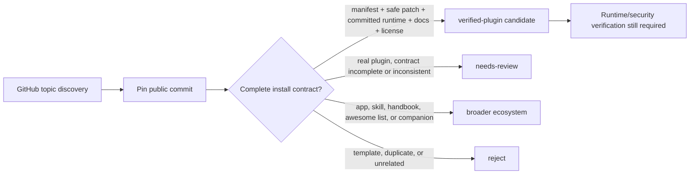

# `topic:dsh-plugin` rolling audit summary

Date: 2026-08-14 (Asia/Shanghai)

## Scope and boundary

GitHub Topic is used only as a discovery surface. The topic changed while the
audit was running, so this is a **rolling audit across dated result fragments**,
not one atomic snapshot of the current Topic page.

Every repository was inspected read-only at a fixed 40-character default-branch
commit. Third-party installers, builds, runtime entries, and tests were not
executed.

| Best-match ranks | GitHub total observed | Verified | Needs review | Ecosystem | Reject |
| ---------------: | --------------------: | -------: | -----------: | --------: | -----: |
|             1–50 |                   452 |       13 |           10 |        22 |      5 |
|           51–100 |                     — |       29 |           10 |        10 |      1 |
|          101–220 |                   467 |       50 |           48 |        21 |      1 |
|          221–340 |                   473 |       46 |           58 |        15 |      1 |
|          341–491 |                   491 |       55 |           69 |        20 |      7 |
|        **Total** |                     — |  **193** |      **195** |    **88** | **15** |

The last fragment was frozen at 2026-08-14 01:37:53–01:37:56 and has a
[complete per-repository ledger](./dsh-plugin-topic-audit-341-491.md). Earlier
fragments were audited with the same decision boundary, but their changing
ordering means these repository-level counts should not be read as a live Topic
leaderboard.

## Decision boundary

`verified-plugin` means the pinned source exposes a coherent static install
contract. It does **not** mean the code passed a security audit, runtime smoke
test, compatibility test, or received endorsement from DeepSeek or dsh.pub.

## First curated collection

Version 1 deliberately promotes only five conservative root bundles:

| Repository                     | Why it is in the first collection                                             |
| ------------------------------ | ----------------------------------------------------------------------------- |
| `omdsh-dev/dsh-open-in-vscode` | Small, inspectable Web-to-Host action                                         |
| `omdsh-dev/dsh-at-file`        | Clear input-trigger, dock, settings, and Host expansion boundary              |
| `omdsh-dev/dsh-notification`   | Bounded Host projection plus browser-local notification behavior              |
| `omdsh-dev/dsh-genui`          | Representative model-tool and Web UI composition plugin                       |
| `ccch1mneyyy/dsh-cc-tui`       | Representative terminal-native profile layer, kept distinct from Web UI slots |

All five catalog commands are pinned to the reviewed commit. Their badge means
“pinned source contract reviewed”, not “safe”, “official”, or “recommended”.

## Next review gate

Promotion of the remaining candidates should add, in order:

1. isolated install and profile boot;
2. requested permission and data-egress inventory;
3. UI slot/tool contract extraction from source;
4. license and maintainer provenance checks;
5. compatibility against the catalog's pinned Harness commit.
